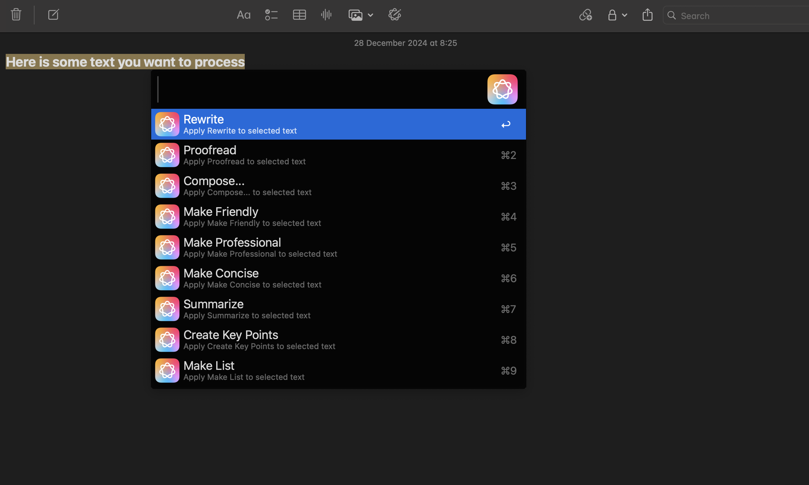

# Use Apple Intelligence Writing Tools From Alfred App

## Installation
1. Download the workflow from the [release page](https://github.com/denpy/alfred-ai-writing-tools/releases).
2. Install the workflow by double-clicking the downloaded file. 

## Usage
1. Select the text you want to process. 
2. Invoke Alfred and type `wt`and press `Enter`. 
3. Select the tool you want to use.

## Screenshot

